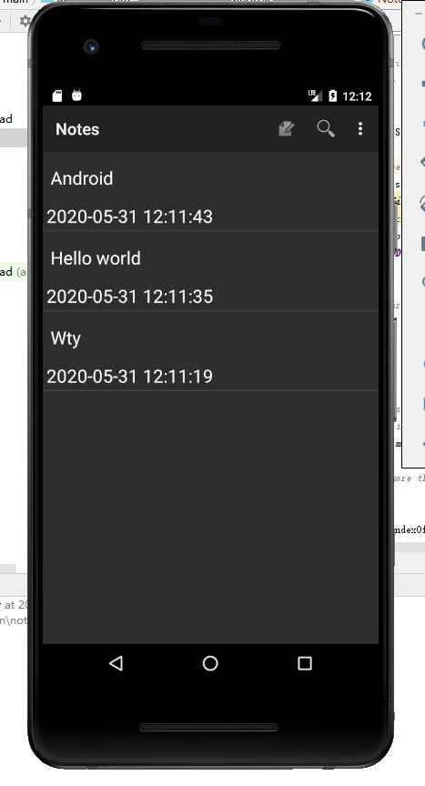
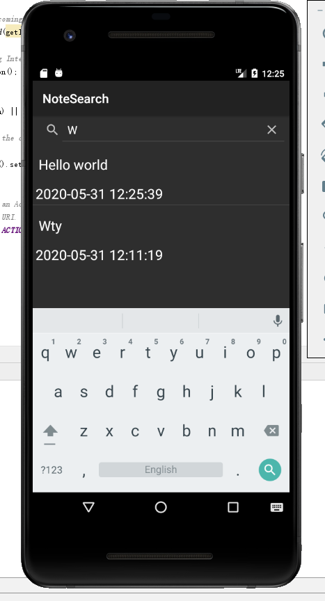

# 期中实验：NotePad加时间戳和搜索框

### 1.加时间戳

第一步：在notelist里PROJECTION中加入时间字段（后面用于sqlite读取）

```
private static final String[] PROJECTION = new String[] {
            NotePad.Notes._ID, // 0
            NotePad.Notes.COLUMN_NAME_TITLE, // 1
            NotePad.Notes.COLUMN_NAME_MODIFICATION_DATE,//在这里加入了修改时间的显示
    };
```

第二步：在noteslist_item.xml中增加一个用来显示时间的TextView

```
<TextView
        android:id="@+id/text2"
        android:layout_width="match_parent"
        android:layout_height="wrap_content"
        android:textAppearance="?android:attr/textAppearanceLarge"
        android:gravity="center_vertical"
        android:singleLine="true"/>
```

第三步：（无操作）原程序创建的数据库已经有了底层时间的创建和修改时间

```
public void onCreate(SQLiteDatabase db) {
           db.execSQL("CREATE TABLE " + NotePad.Notes.TABLE_NAME + " ("
                   + NotePad.Notes._ID + " INTEGER PRIMARY KEY,"
                   + NotePad.Notes.COLUMN_NAME_TITLE + " TEXT,"
                   + NotePad.Notes.COLUMN_NAME_NOTE + " TEXT,"
                   + NotePad.Notes.COLUMN_NAME_CREATE_DATE + " INTEGER,"
                   + NotePad.Notes.COLUMN_NAME_MODIFICATION_DATE + " INTEGER"
                   + ");");
       }
```

第四步：修改适配器，添加dataColumns到ListView

```
String[] dataColumns = { NotePad.Notes.COLUMN_NAME_TITLE
                ,NotePad.Notes.COLUMN_NAME_MODIFICATION_DATE} ;//适配器加时间参数
        // The view IDs that will display the cursor columns, initialized to the TextView in
        // noteslist_item.xml
        int[] viewIDs = { android.R.id.text1 ,R.id.text2};  //适配器加时间参数
```

第五步：修改NoteEditor中updateNote()方法中的时间类型

把Long型的底层时间转换成年月日形的时间

```
        Long now = Long.valueOf(System.currentTimeMillis());
        SimpleDateFormat sdf = new SimpleDateFormat("yyyy-MM-dd HH:mm:ss");
        String time = sdf.format(new Date(Long.parseLong(String.valueOf(now))));
        values.put(NotePad.Notes.COLUMN_NAME_MODIFICATION_DATE, time);
```

运行结果如下：



### 2.加搜索框

第一步：在list_options_menu.xml里创建一个按钮作为后面的搜索框

```
    <item
        android:id="@+id/menu_search"
        android:icon="@android:drawable/ic_menu_search"
        android:title="请输入搜索内容...."
        android:showAsAction="always"
        />
```

第二步：在onOptionsItemSelected的switch里加点击后的动作

```
case R.id.menu_search:
                startActivity(new Intent(Intent.ACTION_SEARCH,getIntent().getData()));
                return true;
```

第三步：在AndroidManifest.xml里加intent的声明

```
<activity
            android:name=".NoteSearch"
            android:label="NoteSearch"
            >

            <intent-filter>
                <action android:name="android.intent.action.NoteSearch" />
                <action android:name="android.intent.action.SEARCH" />
                <action android:name="android.intent.action.SEARCH_LONG_PRESS" />
                <category android:name="android.intent.category.DEFAULT" />
                <data android:mimeType="vnd.android.cursor.dir/vnd.google.note" />
                <!--1.vnd.android.cursor.dir代表返回结果为多列数据-->
                <!--2.vnd.android.cursor.item 代表返回结果为单列数据-->
            </intent-filter>
        </activity>
```

第四步：创建NoteSearch.java通过SearchView实现搜索

前面notelist里的数据定义

```
private static final String[] PROJECTION = new String[]{
            NotePad.Notes._ID, // 0
            NotePad.Notes.COLUMN_NAME_TITLE, // 1
            NotePad.Notes.COLUMN_NAME_MODIFICATION_DATE,//在这里加入了修改时间的显示
    };
```

加个activity启动

```
setContentView(R.layout.searchview);
```

获取intent

```
Intent intent = getIntent();// Gets the intent that started this Activity.
         // If there is no data associated with the Intent, sets the data to the default URI, which
         // accesses a list of notes.
        if (intent.getData()==null){
            intent.setData(NotePad.Notes.CONTENT_URI);
        }
        getListView().setOnCreateContextMenuListener(this);
```

实现接口

```
 @Override
    public boolean onQueryTextSubmit(String query) {
        return false;
    }
```

```
public boolean onQueryTextChange(String s) { //Test改变的时候执行的内容
        //Text发生改变时执行的内容
        String selection = NotePad.Notes.COLUMN_NAME_TITLE + " Like ? ";//查询条件
        String[] selectionArgs = { "%"+s+"%" };//查询条件参数，配合selection参数使用,%通配多个字符

        //查询数据库中的内容,当我们使用 SQLiteDatabase.query()方法时，就会得到Cursor对象， Cursor所指向的就是每一条数据。
        //managedQuery(Uri, String[], String, String[], String)等同于Context.getContentResolver().query()
        Cursor cursor = managedQuery(
                getIntent().getData(),            // Use the default content URI for the provider.用于ContentProvider查询的URI，从这个URI获取数据
                PROJECTION,                       // Return the note ID and title for each note. and modifcation date.用于标识uri中有哪些columns需要包含在返回的Cursor对象中
                selection,                        // 作为查询的过滤参数，也就是过滤出符合selection的数据，类似于SQL的Where语句之后的条件选择
                selectionArgs,                    // 查询条件参数，配合selection参数使用
                NotePad.Notes.DEFAULT_SORT_ORDER  // Use the default sort order.查询结果的排序方式，按照某个columns来排序，例：String sortOrder = NotePad.Notes.COLUMN_NAME_TITLE
        );

        //一个简单的适配器，将游标中的数据映射到布局文件中的TextView控件或者ImageView控件中
        String[] dataColumns = { NotePad.Notes.COLUMN_NAME_TITLE ,  NotePad.Notes.COLUMN_NAME_MODIFICATION_DATE };
        int[] viewIDs = { android.R.id.text1 , R.id.text2 };
        SimpleCursorAdapter adapter = new SimpleCursorAdapter(
                this,                   //context:上下文
                R.layout.noteslist_item,         //layout:布局文件，至少有int[]的所有视图
                cursor,                          //cursor：游标
                dataColumns,                     //from：绑定到视图的数据
                viewIDs                          //to:用来展示from数组中数据的视图
                //flags：用来确定适配器行为的标志，Android3.0之后淘汰
        );
        setListAdapter(adapter);
        return true;
    }
```

后面一个监听器直接从notelist搬

运行结果如下：

